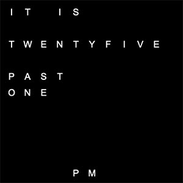

# QClockTwo

This clock in the style of a QClockTwo is a sleek, desktop word clock application built with Python and Tkinter. It displays the time in a unique, text-based format using a grid of letters, where specific words are highlighted to indicate the current time (e.g., "IT IS HALF PAST THREE"). The app supports dynamic timezone updates based on city input, features a draggable window, and integrates seamlessly with the macOS menu bar, including a custom About dialog.

> [!NOTE]
> This app has nothing to do with the original QClock app, which was a Qt-based word clock. This is a completely new implementation using Python and Tkinter.

## Features

- **Word Clock Display**: Shows time in a 11x11 letter grid, highlighting words like "QUARTER PAST" or "TEN TO" to represent the current time.
- **Timezone Support**: Automatically detects the system timezone or allows users to set a custom timezone by entering a city name.
- **Draggable Window**: Frameless window that can be moved by clicking and dragging anywhere on the app.
- **Responsive Updates**: Updates the time display every 5 minutes to reflect the current time in the selected timezone.

## Screenshots

<div style="display: flex; gap: 10px;">
  
  
</div>


## Installation

### Prerequisites

- Python 3.12 or higher (I tried with 3.9 and it did not work, because Tkinter is buggy there)
- macOS (for full menu integration; other platforms may work but are untested)
- Required Python packages (see [Dependencies](#dependencies))

### Build from Source

1. Clone the repository:
   ```bash
   git clone https://github.com/your-username/qclocktwo.git
   cd QClockTwo

2. Install dependencies:
   ```bash
   pip install -r requirements.txt
   ```
3. Run the application:
   ```bash
   python3.12 qclocktwo.py
   ```

## Build a Standalone macOS App

To create a standalone .app with optimized file size (~15MB), use PyInstaller with UPX:

1. Install UPX:

   ```bash
   brew install upx
   ```
2. Install PyInstaller in the virtual environment if you haven't already:
   ```bash
   python3 -m venv venv # Create a virtual environment
   source venv/bin/activate # Activate the virtual environment
   pip install pyinstaller
   ```
3. Generate a `.spec` file (it is also included in this repo if you are lazy):
   ```bash
   pyinstaller --onefile --windowed --name "QClockTwo" qclocktwo.py
   ```
4. Edit the generated `QClockTwo.spec` file to include UPX compression:
   ```python
   a = Analysis(
    ['qclocktwo.py'],
    pathex=[],
    binaries=[],
    datas=[],
    hiddenimports=['pytz', 'tzlocal'],
    hookspath=[],
    hooksconfig={},
    runtime_hooks=[],
    excludes=['numpy', 'pillow', 'geopy', 'timezonefinder', 'ttkwidgets', 'cffi', 'pycparser', 'geographiclib', 'h3'],
    noarchive=False)
   a.datas += [
      ('tcl8.6', '/System/Library/Frameworks/Tcl.framework/Versions/8.6/Resources/tcl8.6', 'DATA'),
      ('tk8.6', '/System/Library/Frameworks/Tk.framework/Versions/8.6/Resources/tk8.6', 'DATA'),
   ]
   a.datas = [(d[0], d[1], d[2]) for d in a.datas if not ('tcl8.6' in d[0] and ('demos' in d[0] or 'msgs' in d[0] or 'encoding' in d[0]))]
   a.datas = [(d[0], d[1], d[2]) for d in a.datas if not ('tk8.6' in d[0] and ('images' in d[0] or 'demos' in d[0]))]
   pyz = PYZ(a.pure)
   exe = EXE(
      pyz,
      a.scripts,
      a.binaries,
      a.zipfiles,
      a.datas,
      [],
      name='QClockTwo',
      debug=False,
      bootloader_ignore_signals=False,
      strip=False,
      upx=True,
      upx_exclude=['libtcl*.dylib', 'libtk*.dylib'],
      runtime_tmpdir=None,
      console=False,
      target_arch=None,
      codesign_identity=None,
      entitlements_file=None
   )
   app = BUNDLE(
      exe,
      name='QClockTwo.app',
      icon=None,
      bundle_identifier=None
   )
   ```

5. Build the app:
   ```bash
   pyinstaller QClockTwo.spec
   ```
6. The executable will be created in the `dist` directory. You can move it to your Applications folder or wherever you prefer.

## Dependencies
The app relies on the following Python packages, listed in requirements.txt:

```bash
tk==0.1.0
tzlocal==5.2
pytz==2024.1
pyinstaller==6.13.0
```

Install them with:

```bash
(choose one of the following based on your Python version)
pip install tk geopy ttkwidgets tzlocal timezonefinder
pip3 install tk geopy ttkwidgets tzlocal timezonefinder
pip3.12 install tk geopy ttkwidgets tzlocal timezonefinder
```

## Usage
- Launch the App: Run `python3.12 qclocktwo.py` or the built `QClockTwo.app`.
- View Time: The 11x11 letter grid displays the current time (e.g., "IT IS TWENTY FIVE PAST SEVEN"). Words are highlighted in white, with inactive letters in dark gray.
- Change Timezone: Click the "Settings" menu to enter a city name for timezone detection. The app will update the time display accordingly.
- Drag the Window: Click and drag anywhere on the app to move it around your desktop.
- Context menu: Right-click on the app window to access the context menu, which includes options like `timezone` and `visibility`.

## Configuration
- Timezone: Defaults to the system timezone (detected via tzlocal). Set a custom timezone via the Settings menu.
- Autocomplete: The city input field supports autocomplete for easier timezone selection.
- Letter Grid: The 11x11 grid is defined in LETTER_GRID within `qclocktwo.py`. Modify it to change the word layout (ensure corresponding changes in minute_map and hour_map).
- Update Interval: The clock updates every 5 minutes (300,000 ms). Adjust the interval in the update_clock method if needed.

## Development Notes

- The app is designed for macOS but may work on other platforms with Tkinter support.
- Code Structure:
    - `LETTER_GRID`: Defines the 11x11 letter grid.
    - `HIGHLIGHT_GRID`: Manages which letters are highlighted based on the time.
    - `WordClockApp`: Main application class handling the UI and logic.

## Known Limitations
- Timezone lookup requires an internet connection for geopy.
- The app is primarily tested on macOS; other platforms may have untested behavior.